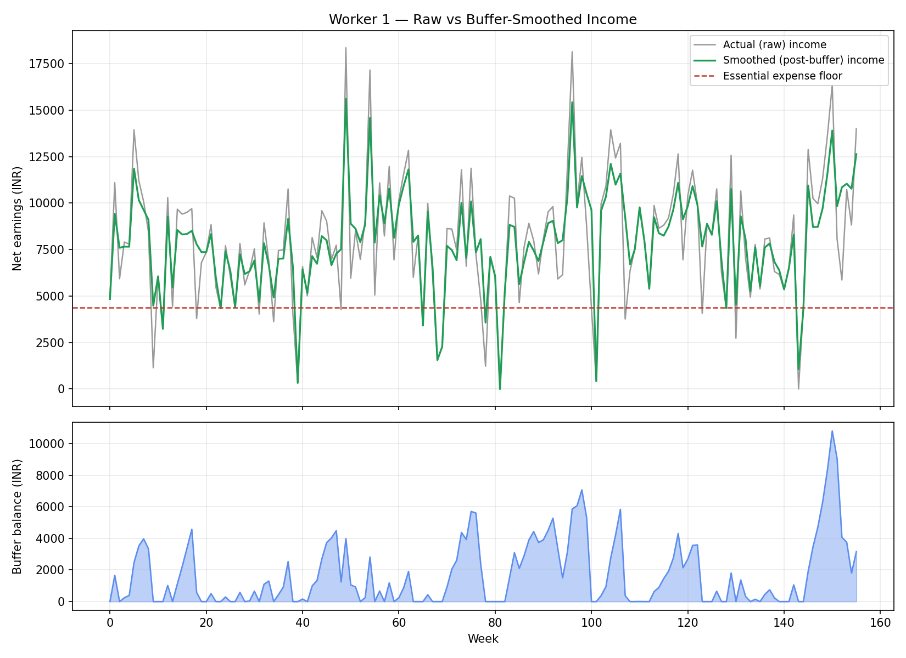
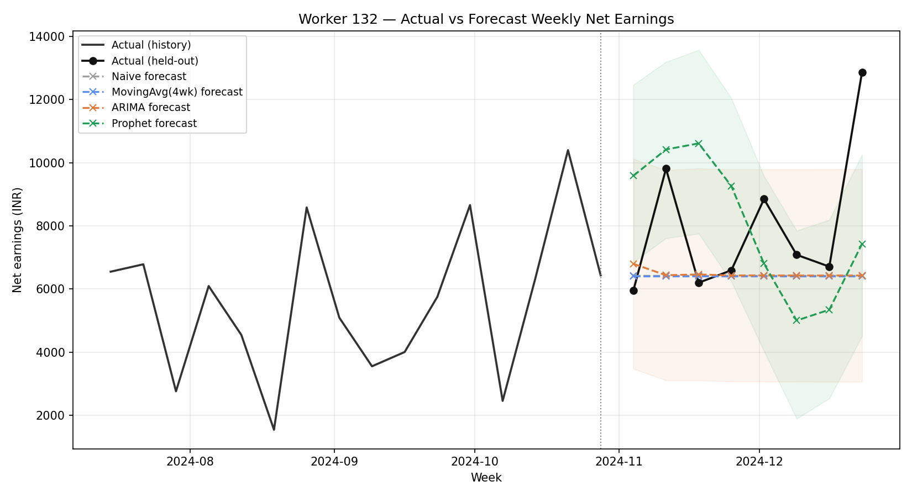
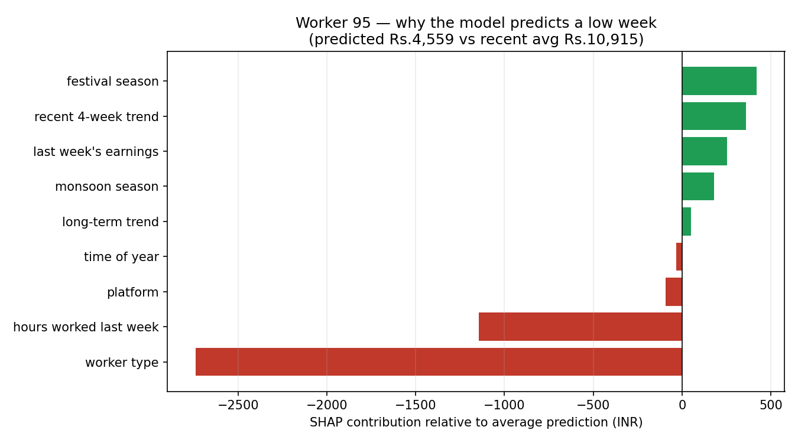
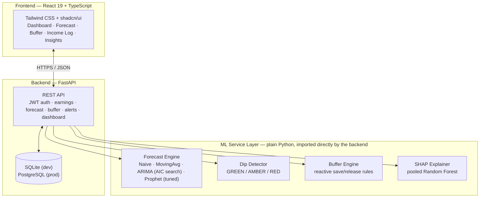

<div align="center">

# Glide

**Predictive Income Smoothing for Gig Economy Workers, Built on Machine Learning**

Forecasts a gig worker's income, detects a dip before it happens, and automatically
smooths it out with an explainable micro-savings buffer.

[](https://github.com/nayana3333/Glide/actions/workflows/tests.yml)
[](LICENSE)


[Overview](#overview) • [Demo](#demo) • [Results](#headline-results) • [Architecture](#architecture) • [Quick Start](#quick-start) • [Paper](#academic-paper)

</div>

---

## Overview

Gig workers — Ola/Uber drivers, Swiggy/Zomato delivery, Urban Company freelancers —
earn irregularly, with no salary floor and no employer-provided safety net. Published
research on transaction-level data shows platform-economy income can vary by up to
**30% month-to-month** [1], and that a worker's *sense of control* over that volatility,
not the volatility itself, predicts financial and psychological outcomes [2]. Most tools
in this space either track spending after the fact, or predict a *typical* wage from
static attributes — neither tells an individual worker *when* their income is about to
fall, or does anything about it.

**Glide does three things existing systems don't combine:**

| | |
|---|---|
| 🔮 **Forecast** | Models a worker's weekly income as a seasonal time series (weekday cycles, monsoon, festivals) using tuned ARIMA and Prophet models |
| 🚦 **Detect** | Classifies each forecasted week into a GREEN / AMBER / RED dip alert against the worker's own rolling average |
| 💰 **Act** | A rule-based buffer engine automatically saves part of a surplus week and releases it during a deficit week — every transaction explained and worker-confirmed, never silent |

Every result on this page is real, from this repository's own code, not illustrative
numbers — including the two places tuning didn't help and the security bug that got
found and fixed along the way. See [Honest findings](#honest-findings-not-just-the-wins).

## Demo

> 🖼️ **Screenshots/demo GIF not added yet.** The app is fully working (see
> [Quick Start](#quick-start) to run it yourself), but this build environment can't
> render browser frames to capture real screenshots, and placeholder images that don't
> exist yet would just show as broken links here — so instead of that, see
> [`docs/screenshots/README.md`](docs/screenshots/README.md) for the exact shot list
> and a 5-minute how-to. Once added, they'll go here: login/register, dashboard,
> forecast + SHAP panel, buffer, insights, and mobile nav.

## Headline Results

**34.5% reduction in weeks where income fell below the essential-expense floor** —
simulated across all 200 workers over 3 years of history, buffer active vs. not.



Full 8-week-ahead forecast comparison, all 200 workers, after hyperparameter tuning:

| Model | MAE (₹) | RMSE (₹) | sMAPE | Asymmetric Cost |
|---|---:|---:|---:|---:|
| **ARIMA** (AIC order search) | **2,762** | **3,388** | 36.7% | **3,553** |
| Prophet (tuned) | 2,819 | 3,452 | 36.8% | 4,227 |
| Moving Average (4wk) | 2,895 | 3,498 | 37.0% | 4,555 |
| Naive | 3,825 | 4,451 | 49.7% | 5,946 |

Both real models clearly beat both baselines — the result that actually matters. See
[`ml/artifacts/model_comparison.csv`](ml/artifacts/model_comparison.csv) for the raw numbers.



**Explainability isn't decorative** — SHAP attributes each prediction to real features
in ₹ terms, and the model is free to disagree with the designer's expectations:



### Honest findings, not just the wins

A portfolio project that only reports wins isn't credible. These are reported exactly
as found:

- **Prophet's hyperparameter sweep confirmed its own defaults** (`changepoint_prior_scale=0.05`,
  `seasonality_prior_scale=10.0`) rather than finding something better — still a useful
  result, since it's now a *validated* choice instead of an unexamined one.
- **Per-series ARIMA order search moved accuracy by ~0.4%**, essentially noise, despite
  selecting a different order for every worker. Explained in the [paper](#academic-paper):
  AIC optimizes in-sample fit, not out-of-sample forecast error, and this dataset's
  workers share one generative process, so a single reasonable order already covered
  most of the variation.
- **SHAP attributed a predicted dip mostly to worker archetype and recent hours**, not
  the seasonal story you'd expect — the model is reporting what it actually learned.
- **0 of 200 workers reached zero remaining shortfall weeks.** The buffer reduces
  shortfalls, it doesn't eliminate them, particularly across sustained multi-week
  downturns. Named directly as a limitation, not hidden.
- **A real access-control bug was found and fixed mid-build**: routes taking a worker ID
  in the path checked that a caller had *a* valid token, not that the token belonged to
  *that* worker — any logged-in user could read another worker's financial data by
  editing the URL. See [`auth_service.py`](backend/app/services/auth_service.py)'s
  `require_self()`.

## Architecture



The same forecast/buffer/explainer code exercised in offline evaluation
(`ml/models/evaluate.py`, `ml/models/buffer_simulation.py`) is imported directly by the
backend — the live API is not a separate re-implementation of the research code.

## Features

- **Predictive dashboard** — buffer balance, next-week forecast with dip badge, recent-earnings chart
- **4-week forecast with confidence bands** and a week-by-week SHAP explanation panel
- **Automatic + manual buffer** — reactive save/release schedule, plus worker-confirmed manual deposits/withdrawals
- **Income log** — manual earnings entry with full history, validated with `react-hook-form` + `zod`
- **Insights** — monthly trend, best-earning weeks, and a transparently-labeled financial health heuristic
- **Dark/light theme**, persisted, no flash-of-wrong-theme on load
- **Responsive** — collapsible mobile nav drawer, since the real user base is phone-first
- **JWT auth** with per-resource authorization (see the security fix above)
- **Toast notifications and skeleton loading states** throughout, not raw "Loading..." text

## Tech Stack

| Layer | Stack |
|---|---|
| **Frontend** | React 19, TypeScript, Vite, Tailwind CSS v4, shadcn/ui, React Router, Recharts, react-hook-form + zod, Sonner |
| **Backend** | FastAPI, SQLAlchemy, Pydantic, python-jose (JWT), passlib (bcrypt) |
| **ML** | Prophet, statsmodels (ARIMA), scikit-learn (Random Forest), SHAP, pandas, NumPy |
| **Data** | SQLite (dev) / PostgreSQL (prod) |
| **Testing** | pytest (backend + ML unit tests), `tsc --noEmit` |
| **CI/CD** | GitHub Actions — 4 independent jobs: lint, ML unit tests, backend smoke test, frontend build |
| **Tooling** | ruff (lint), Vite, npm |

## Quick Start

Requires Python 3.13+, Node 20+.

```bash
# 1. Clone
git clone https://github.com/nayana3333/Glide.git
cd Glide

# 2. ML pipeline — generates the synthetic dataset and runs the full evaluation
cd ml
pip install -r requirements.txt
python data/generator.py            # 200 workers x 156 weeks
python models/evaluate.py --full    # forecast model comparison (~20 min, tunes ARIMA per worker)
python models/buffer_simulation.py  # headline 34.5% result
python models/explain.py            # SHAP explainability

# 3. Backend — from repo root, in a new terminal
cd backend
pip install -r requirements.txt
python -m uvicorn app.main:app --reload --port 8000
# Swagger docs: http://localhost:8000/docs

# 4. Frontend — from repo root, in a new terminal
cd frontend
npm install
npm run dev
# App: http://localhost:5174
```

Register with an optional **demo worker ID** (1–200) to seed a new account with a
synthetic worker's 3-year earnings history, so every page has real data immediately
instead of an empty state.

## Testing & CI

```bash
# Backend + ML tests
cd backend && python -m pytest tests/ -v
cd ml && python -m pytest tests/ -v

# Lint
ruff check ml/ backend/

# Frontend typecheck + build
cd frontend && npm run build
```

Every push to `main` runs all four independently in [GitHub Actions](.github/workflows/tests.yml),
so a slow or flaky job never blocks the others.

## API Reference

Full interactive docs (Swagger UI) at `/docs` once the backend is running. Summary:

| Method | Endpoint | Description |
|---|---|---|
| `POST` | `/api/auth/register` | Create account, optional `demo_worker_id` seed |
| `POST` | `/api/auth/login` | Get a JWT |
| `GET` | `/api/auth/me` | Current user profile |
| `GET/POST` | `/api/earnings` | List / log weekly earnings |
| `GET` | `/api/forecast/{worker_id}` | 4-week Prophet forecast + dip levels |
| `GET` | `/api/forecast/explain/{worker_id}` | SHAP explanation for the next prediction |
| `GET` | `/api/buffer/{worker_id}` | Balance + transaction history |
| `POST` | `/api/buffer/deposit` \| `/withdraw` | Manual buffer transactions |
| `GET` | `/api/alerts/{worker_id}` | Dip alerts derived from the forecast |
| `GET` | `/api/dashboard/{worker_id}` | Aggregated dashboard view |

## Project Structure

```
glide/
├── ml/
│   ├── data/generator.py          # synthetic dataset: 200 workers x 156 weeks
│   ├── models/
│   │   ├── forecast_models.py     # Naive, MovingAvg, ARIMA (AIC search), Prophet (tuned)
│   │   ├── tune_prophet.py        # Prophet hyperparameter sweep
│   │   ├── dip_detector.py        # GREEN/AMBER/RED classification
│   │   ├── buffer_engine.py       # save/release simulation
│   │   ├── buffer_simulation.py   # headline 34.5% result
│   │   ├── explain.py             # SHAP explainability
│   │   └── evaluate.py            # full model comparison harness
│   ├── tests/                     # unit tests for dip_detector, buffer_engine
│   └── artifacts/                 # generated charts + comparison tables (tracked)
├── backend/
│   └── app/
│       ├── models/                # SQLAlchemy: User, Earnings, BufferTransaction, Alert
│       ├── routers/                # auth, earnings, forecast, buffer, alerts, dashboard
│       ├── services/               # auth, forecast, buffer, explain — wraps ml/
│       └── schemas/                # Pydantic request/response models
├── frontend/
│   └── src/
│       ├── pages/                 # Dashboard, Forecast, Buffer, IncomeLog, Insights, Auth
│       ├── components/ui/         # shadcn/ui primitives
│       ├── context/AuthContext.tsx
│       └── lib/api.ts             # typed API client, mirrors backend Pydantic schemas
├── docs/
│   ├── paper/                     # IEEE-format paper draft
│   └── screenshots/                # README images (see its own README for how-to)
└── .github/workflows/tests.yml    # CI: lint, ML tests, backend smoke test, frontend build
```

## Academic Paper

A full IEEE-format paper draft — literature review, methodology, and every result on
this page — is in [`docs/paper/Glide_IEEE_Paper.docx`](docs/paper/Glide_IEEE_Paper.docx).

## Roadmap

- [ ] Live deployment (Render/Vercel)
- [ ] Proactive buffer engine — couple the forecast/dip signal into savings behavior ahead of a predicted dip, not just react to income that already arrived
- [ ] Validation against real platform earnings data
- [ ] Alternative credit scoring from income regularity + buffer discipline
- [ ] LSTM comparison once per-worker history is long enough to justify it

## Author

**Nayana S**
📧 nayanas3333@gmail.com

## License

[MIT](LICENSE)

## References

[1] D. Farrell and F. Greig, "Paychecks, Paydays, and the Online Platform Economy," JPMorgan Chase Institute, 2016.
[2] J. Peetz and J. Robson, "Living Gig to Gig and Paycheque to Paycheque," CEPR / Carleton University, 2022.

Full literature review and citations in the [paper](docs/paper/Glide_IEEE_Paper.docx).
